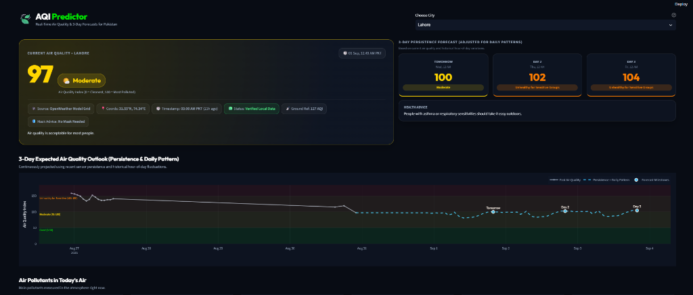
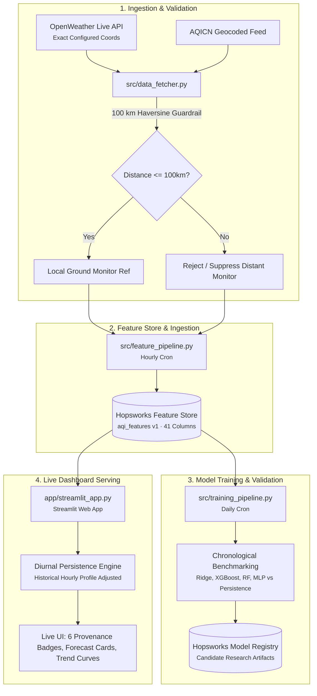

# Pearls AQI Predictor

A serverless system that forecasts Air Quality Index (AQI) across **8 major Pakistani cities** (Lahore, Karachi, Islamabad, Faisalabad, Multan, Peshawar, Rawalpindi, Gujranwala) 24, 48, and 72 hours ahead, with a live dashboard, automated hourly data collection, daily model retraining, and per-prediction explanations.

Built for the **10Pearls SHINE Internship, Data Sciences Track**. For the full technical write-up (architecture, model evaluation, production bugs that shaped the design, and known limitations), see [docs/final_report.md](docs/final_report.md). For the architectural decision records and key design pivots, see [docs/decisions.md](docs/decisions.md). For granular per-city model benchmark metrics, see [docs/model_comparison.md](docs/model_comparison.md).

* **Live dashboard**: [https://aqi-predictor-2026.streamlit.app/](https://aqi-predictor-2026.streamlit.app/)
* **Repository**: [https://github.com/ammu01-sys/aqi-predictor-2026](https://github.com/ammu01-sys/aqi-predictor-2026)


---

## 🖥️ Dashboard Preview


*Fig. 1 — Streamlit live view showing the current AQI hero card (Lahore), 6 provenance badges, 3-day persistence forecast cards, and 72-hour expected air quality outlook.*


*Fig. 2 — Physical pollutant concentration tiles (PM2.5, PM10, O3, NO2, SO2, CO), historical 7-day trend curve, and plain-language physical driver explainability panel.*

---

## Features

* **Multi-City 3-Day Forecast** — Centrally configured for 8 Pakistani cities, serving diurnal-adjusted persistence forecasts calibrated on empirical hourly distributions (beating candidate ML models on chronological test benchmarks).
* **Real EPA AQI Calculation** — Evaluated via the US EPA piecewise linear formula across 6 criteria pollutants ($PM_{2.5}, PM_{10}, O_3, NO_2, SO_2, CO$) to guarantee single-source mathematical consistency.
* **100 km Haversine Spatial Guardrail** — Verifies station coordinates to reject and suppress distant foreign monitors (e.g. Delhi ~403 km, Dushanbe ~564 km) from misrepresenting Pakistani cities.
* **Serverless Hopsworks Feature Store** — 41 strongly-typed engineered features (lags, rolling stats, cyclical time, and dynamic one-hot city encoding).
* **Hourly + Daily Automation via GitHub Actions** — No dedicated servers to maintain.
* **"Why this forecast?"** — Plain-language physical driver summaries (atmospheric inertia, fine particles, nocturnal inversions) with a technical SHAP summary expander.
* **Hazardous AQI Alerts** — Dynamic EPA-aligned alert banner whenever AQI crosses into Unhealthy territory ($\ge 151$).

---

## How it works



The feature pipeline pulls live data for all 8 cities every hour, computes the EPA AQI, checks geographic distance, and writes updates to Hopsworks. Training runs daily on a chronological split of 10,584 records to evaluate and register candidate ML models in the Model Registry. The Streamlit dashboard serves diurnal-adjusted persistence forecasts directly from the Feature Store's historical distributions. Full architectural details are documented in [docs/final_report.md](docs/final_report.md).

---

## Project structure

| File / Directory | Description |
|---|---|
| `app/streamlit_app.py` | Live Streamlit multi-city dashboard with EPA glassmorphism cards and live PKT clock |
| `src/data_fetcher.py` | API client with 100 km Haversine distance guardrail and single-source fallback |
| `src/feature_engineering.py` | Builds lags, rolling statistics, rate of change, and dynamic one-hot city encoding |
| `src/feature_pipeline.py` | Hourly automated job: ingests 8 cities and commits partitioned records to Hopsworks |
| `src/backfill.py` | Historical backfill script populating 60 days of hourly training data from OpenWeather |
| `src/training_pipeline.py` | Daily job: trains Ridge / XGBoost / RF / MLP, evaluates vs persistence, registers candidate models |
| `src/model_wrapper.py` | Hopsworks model serving wrapper |
| `src/utils.py` | Hopsworks connection helper, US EPA piecewise linear formula, and city config loader |
| `config/cities.yaml` | Central configuration file containing coordinates for the 8 Pakistani cities |
| `tests/` | 48 automated tests covering all 8 cities, geographic validation, and pipeline schemas |
| `.github/workflows/` | Scheduled GitHub Actions workflows for hourly ingestion, daily training, and CI tests |
| `docs/final_report.md` | Full final internship project writeup with benchmarks and production post-mortems |
| `docs/decisions.md` | Architectural Decision Records (ADRs) |
| `docs/model_comparison.md` | Granular multi-horizon and per-city benchmark tables |
| `docs/verification_report.md` | Evidence-backed audit report and hand-traced math |

---

## Getting started

### 1. Clone and install dependencies
```bash
git clone https://github.com/ammu01-sys/aqi-predictor-2026.git
cd aqi-predictor-2026
python -m venv .venv
```

Activate the virtual environment:
```bash
# On Windows (PowerShell):
.venv\Scripts\Activate.ps1
# On Linux/macOS:
source .venv/bin/activate
```

Install requirements:
```bash
pip install -r requirements.txt
```

> **Note for Windows users without Microsoft C++ Build Tools**: If building `twofish` fails during `pip install`, install Hopsworks dependencies with `--no-deps`:
> ```bash
> pip install hopsworks pyjks --no-deps
> pip install javaobj-py3 pyasn1 pyasn1-modules pycryptodomex
> pip install -r requirements.txt
> ```

### 2. Set up API keys
Create a `.env` file in the project root (or configure `.streamlit/secrets.toml` for the app):
```env
HOPSWORKS_API_KEY=your_hopsworks_api_key
HOPSWORKS_PROJECT_NAME=aqiii_preditcor
OPENWEATHER_API_KEY=your_openweather_api_key
AQICN_API_KEY=your_aqicn_api_key
```

### 3. Run the dashboard
```bash
streamlit run app/streamlit_app.py
```

### 4. Run tests
```bash
pytest tests/ -v
```

---

## Automation

| Workflow | Schedule | What it does |
|---|---|---|
| **Hourly Feature Pipeline** | `0 * * * *` (Every hour) | Fetches live data for all 8 cities, computes EPA AQI, checks 100km guardrails, and updates Hopsworks Feature Store. |
| **Daily Model Training** | `0 0 * * *` (Daily at 00:00 UTC) | Evaluates candidate models (RidgeCV, XGBoost, RF, MLP) against persistence, saves SHAP plots, and logs models in Hopsworks Model Registry. |
| **CI Test Suite** | On Push / Pull Request | Runs all 48 unit, geographic validation, and pipeline contract tests across all 8 cities. |

Both scheduled workflows are defined in `.github/workflows/` and use repository secrets for API authentication.

---

## License

This project is licensed under the [MIT License](LICENSE).

---

*Pearls AQI Predictor · 10Pearls SHINE Internship · Data Sciences Track*
