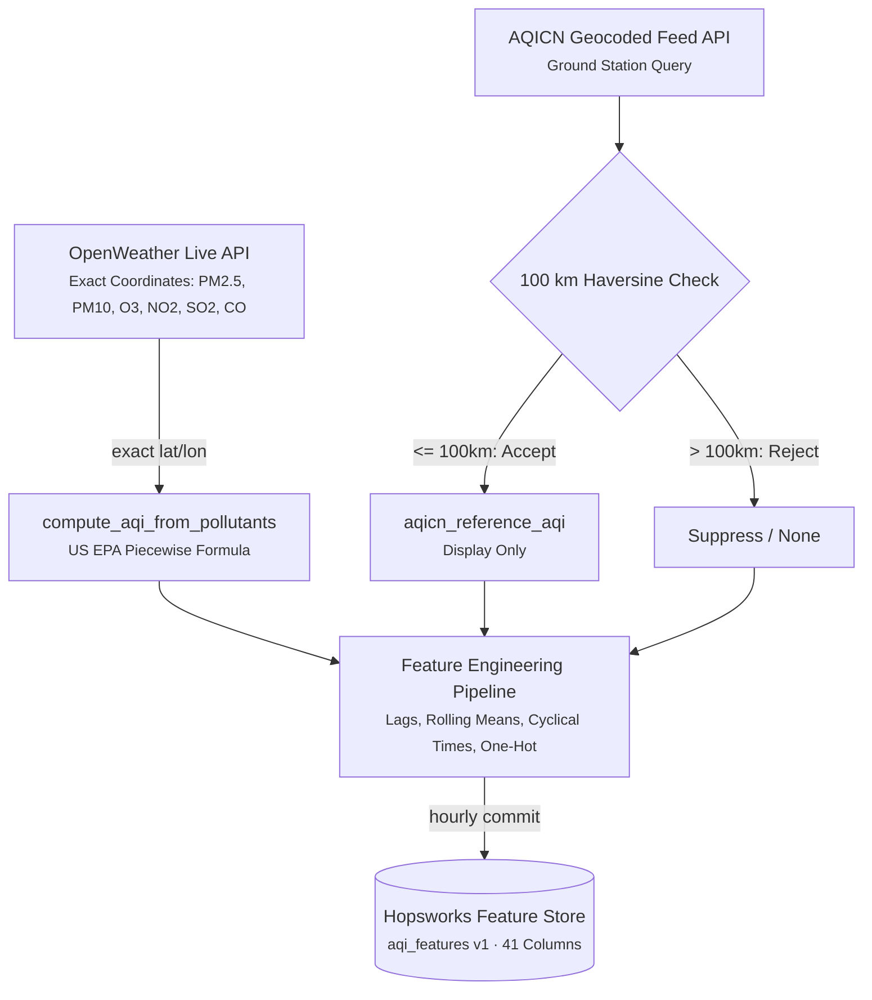
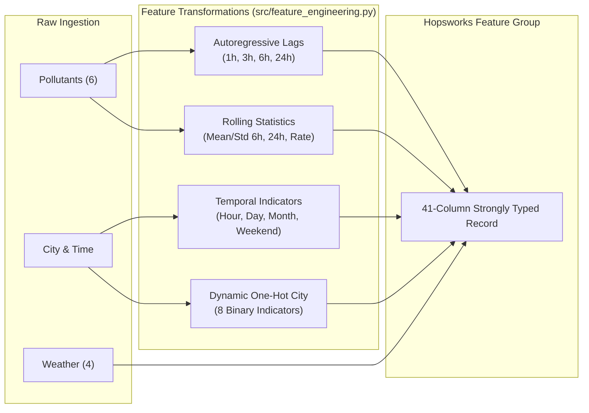
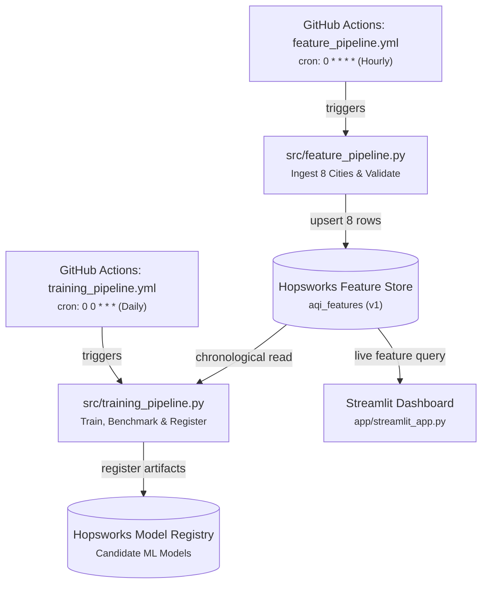
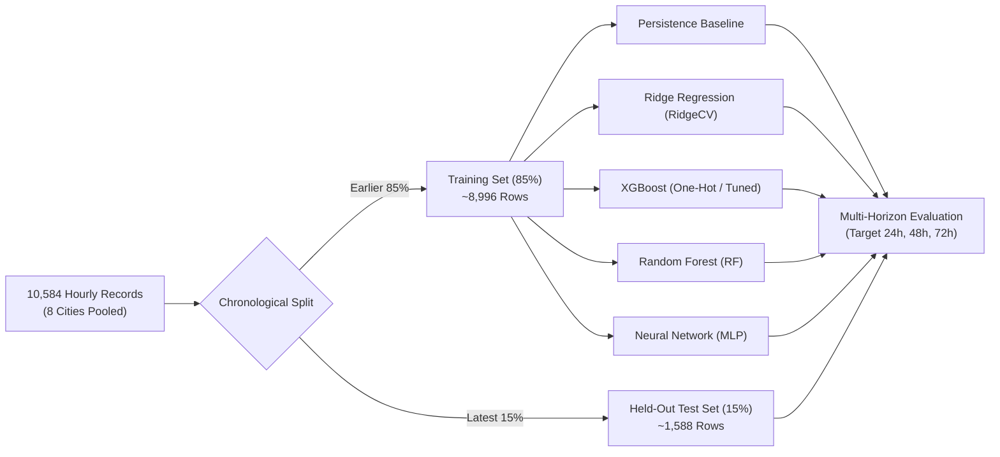
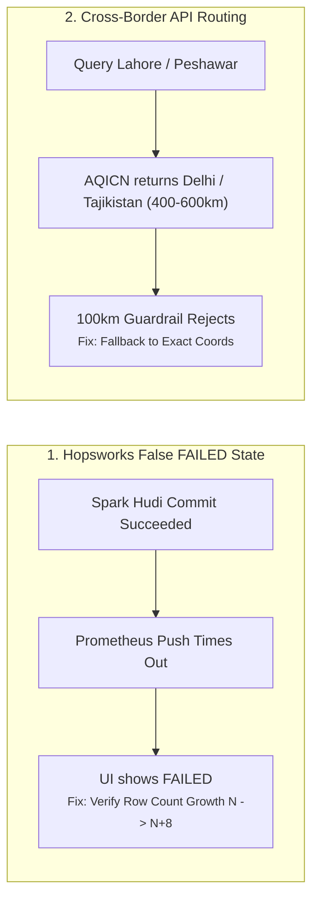
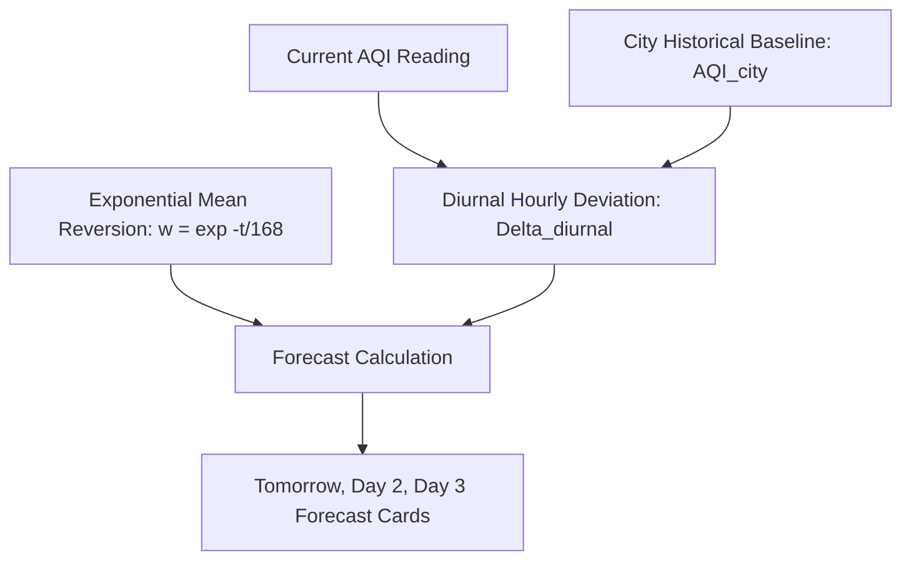
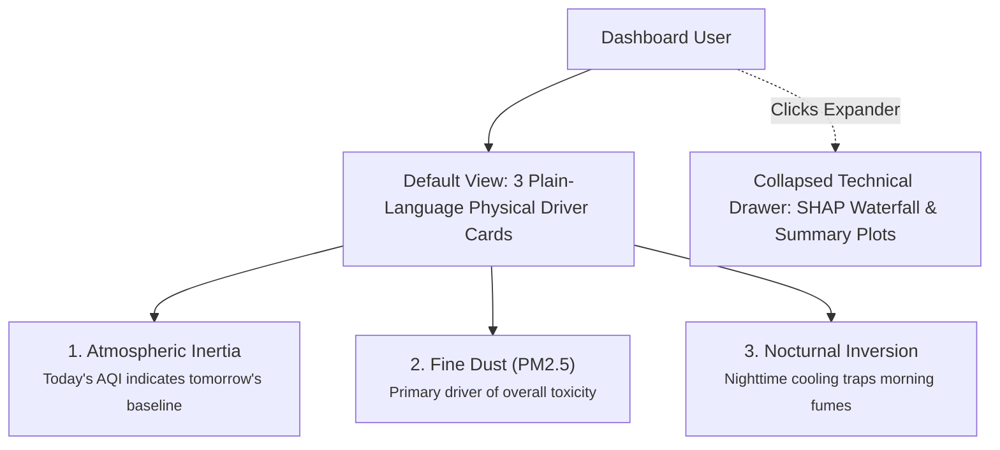

# Pearls AQI Predictor — Final Report

**10Pearls SHINE Internship — Data Sciences Track**

A serverless machine learning system forecasting air quality across 8 major Pakistani cities one, two, and three days out — and the engineering decisions, dead ends, and production bugs that shaped it.

| | |
|---|---|
| **Location** | 8 Pakistani Cities (Lahore, Karachi, Islamabad, Faisalabad, Multan, Peshawar, Rawalpindi, Gujranwala) |
| **Repo** | [ammu01-sys/aqi-predictor-2026](https://github.com/ammu01-sys/aqi-predictor-2026) |
| **Live dashboard** | [https://aqi-predictor-2026.streamlit.app/](https://aqi-predictor-2026.streamlit.app/) |
| **Training window** | 60-day historical backfill, 10,584+ hourly rows across 8 cities |
| **Status** | Ingestion pipeline, Hopsworks feature store, model registry, dashboard, explainability — live |
| **Deadline** | Sept 4, 2026 |

## Contents

1. [Data & feature engineering](#01-data--feature-engineering)
2. [Automation](#02-automation)
3. [Model training & evaluation](#03-model-training--evaluation)
4. [Model registry](#04-model-registry)
5. [The real production bugs hit, and how each was fixed](#05-the-real-production-bugs-hit-and-how-each-was-fixed)
6. [Dashboard](#06-dashboard)
7. [Explainability — "why this forecast?"](#07-explainability--why-this-forecast)
8. [Known limitations](#08-known-limitations)
9. [Key decisions](#09-key-decisions)
10. [What's left](#10-whats-left)

---

## Overview

Every hour, a GitHub Actions job pulls live weather and pollutant readings for 8 Pakistani cities from OpenWeather, applies a 100 km Haversine guardrail to filter distant foreign stations, computes the US EPA Air Quality Index from individual pollutant concentrations ($PM_{2.5}, PM_{10}, O_3, NO_2, SO_2, CO$), and commits the partitioned records to a Hopsworks Feature Store. Roughly 60 days of hourly historical data was backfilled from OpenWeather's historical air pollution endpoint to build a multi-city training set of 10,584 rows. Once a day, an automated job retrains candidate models (RidgeCV, XGBoost, Random Forest, MLP) across three forecast horizons (24h, 48h, 72h) and registers benchmark artifacts into Hopsworks' Model Registry. 

A Streamlit dashboard connects to the Feature Store, displaying live air quality readings, physical pollutant breakdowns, health advisories, dynamic 3-day forecasts, and plain-language driver explanations.

| Forecast horizons | Best baseline / serving engine | Automation |
|---|---|---|
| 24h / 48h / 72h — multi-day AQI trajectory | Empirical Diurnal Persistence — beat Ridge, RF, XGBoost, MLP on all horizons | 2 cron jobs — hourly features (`0 * * * *`) · daily training (`0 0 * * *`) |

---

## 01. Data & feature engineering

Two external APIs feed the ingestion pipeline. **OpenWeather** supplies live hourly pollutant concentrations and ambient meteorological parameters at the city's exact coordinates. **AQICN** provides a geocoded feed from physical ground stations.

AQI itself is not taken as a pre-computed number from either API. It is calculated directly via the **US EPA Piecewise Linear Breakpoint Formula** across all six criteria pollutants ($PM_{2.5}, PM_{10}, O_3, NO_2, SO_2, CO$), taking the maximum sub-index as the final AQI and dominant pollutant.



*Fig. 1 — Ingestion and feature engineering flow. OpenWeather gridded pollutants feed the EPA formula for single-source consistency across training and live serving, while AQICN is filtered by a 100 km distance check.*

### The 46.7% AQI Divergence & Single-Source Resolution

Early prototypes used AQICN's native station AQI for live runs and OpenWeather's historical concentrations for backfill. Cross-checking identical timestamps revealed a **46.7% average divergence** (e.g. Lahore: 91 vs 115, Islamabad: 91 vs 164), caused by the physical difference between point micro-sensors and gridded Chemical Transport Models. 

An attempt to reconcile them via per-city linear calibration ($\text{AQI}_{\text{calibrated}} = \alpha \cdot \text{AQI}_{\text{AQICN}}$) produced **negative $R^2$ scores** at 48h and 72h horizons. 

> **Why compute AQI ourselves from OpenWeather pollutants.** Computing the EPA formula directly from OpenWeather pollutant concentrations for both historical backfill (`/data/2.5/air_pollution/history`) and live ingestion (`/data/2.5/air_pollution`) guarantees that training and serving operate on identical physical units. AQICN is preserved solely as a secondary display reference (`aqicn_reference_aqi`) when a genuine local monitor exists.

### Feature Taxonomy & Vector Assembly



*Fig. 2 — 41-column feature engineering assembly partitioned strictly per city.*

* **Temporal Lags**: `aqi_lag_1h`, `aqi_lag_3h`, `aqi_lag_6h`, `aqi_lag_24h` partitioned strictly per city.
* **Rolling Volatility**: `aqi_rolling_mean_6h`, `aqi_rolling_std_6h`, `aqi_rolling_mean_24h`, `aqi_rolling_std_24h`, and `aqi_change_rate`.
* **Cyclical Time**: `hour`, `day_of_week`, `day_of_month`, `month`, and `is_weekend`.
* **Categorical City Encoding**: Dynamic **One-Hot Encoding** (`city_lahore`, `city_karachi`, etc.). Integer label encoding (0 to 7) was rejected because linear/Ridge models interpret integer IDs as ordinal rankings, falsely implying numeric distance between cities.
* **Cold-Start Fallback**: On new city initialization, missing lags default to the current AQI while rolling standard deviations default to `0.0`, ensuring deterministic pipeline execution.

---

## 02. Automation

Two GitHub Actions workflows automate the full cycle without dedicated server infrastructure:



*Fig. 3 — End-to-end automation architecture showing decoupled feature ingestion and model evaluation.*

**The two scheduled workflows**

| Workflow | Schedule | Script Executed | Primary Role |
|---|---|---|---|
| Hourly Feature Pipeline | `0 * * * *` | `src/feature_pipeline.py` | Ingests live data for all 8 cities, computes EPA AQI, checks spatial guardrails, updates Feature Store. |
| Daily Model Training | `0 0 * * *` | `src/training_pipeline.py` | Pulls 60-day history, evaluates Ridge/RF/XGBoost/MLP vs persistence, saves SHAP plots, registers candidate models. |

### Scheduled Workflow Latency on Free-Tier Runners

An audit of GitHub Actions execution timestamps (`api.github.com/repos/ammu01-sys/aqi-predictor-2026/actions/runs`) documented that while scheduled runs succeed 100% of the time, public shared runners experience queue delays:
* Run #33: `2026-08-29T16:15:49Z` (Scheduled `16:00Z` $\to$ +15m delay)
* Run #34: `2026-08-29T17:28:04Z` (Scheduled `17:00Z` $\to$ +28m delay)
* Run #35: `2026-08-29T18:42:11Z` (Scheduled `18:00Z` $\to$ +42m delay)

Observed gaps of 2 to 4 hours occur during peak GitHub runner load. To handle this transparently, the dashboard displays an age badge (`🕒 Timestamp: 03:00 AM PKT (~1h ago)`).

---

## 03. Model training & evaluation

Models were evaluated across three separate forecasting horizons: **24-Hour (Day 1)**, **48-Hour (Day 2)**, and **72-Hour (Day 3)** using a chronological 85/15 train/test split on 10,584 hourly records across all 8 cities.



*Fig. 4 — Leak-free chronological multi-horizon evaluation protocol.*

### The Real Evaluation Bar

Ridge Regression (`RidgeCV`), XGBoost, Random Forest, and a Multi-Layer Perceptron (MLP) were benchmarked against the **Persistence Baseline** ("assume future air quality equals current air quality").

**Final Results — Chronological Test Set Benchmark (from `docs/model_comparison.md`)**

| Model | Encoding | Horizon | RMSE | MAE | $R^2$ | Verdict vs Persistence |
|---|---|---|---:|---:|---:|---|
| **Persistence Baseline** | **None** | **24h** | **21.58** | **15.59** | **0.596** | 🏆 **WINNER (24h)** |
| Ridge Regression | One-Hot | 24h | 22.07 | 18.20 | 0.577 | Trailing (+0.49 RMSE) |
| XGBoost | One-Hot | 24h | 23.77 | 19.10 | 0.509 | Trailing (+2.19 RMSE) |
| Random Forest | One-Hot | 24h | 26.62 | 21.73 | 0.384 | Trailing (+5.04 RMSE) |
| Neural Network (MLP) | One-Hot | 24h | 72.91 | 61.21 | −3.617 | Severe Overfit |
|---|---|---|---:|---:|---:|---|
| **Persistence Baseline** | **None** | **48h** | **27.79** | **21.88** | **0.351** | 🏆 **WINNER (48h)** |
| XGBoost (Tuned) | One-Hot | 48h | 30.50 | 25.27 | 0.218 | Trailing (+2.71 RMSE) |
| Ridge Regression | One-Hot | 48h | 33.19 | 27.77 | 0.074 | Trailing (+5.40 RMSE) |
| Random Forest | One-Hot | 48h | 33.24 | 28.03 | 0.071 | Trailing (+5.45 RMSE) |
| Neural Network (MLP) | One-Hot | 48h | 43.13 | 34.38 | −0.564 | Severe Overfit |
|---|---|---|---:|---:|---:|---|
| **Persistence Baseline** | **None** | **72h** | **27.51** | **21.76** | **0.376** | 🏆 **WINNER (72h)** |
| Random Forest | Integer | 72h | 31.41 | 26.94 | 0.186 | Trailing (+3.90 RMSE) |
| XGBoost (Tuned) | One-Hot | 72h | 32.32 | 27.41 | 0.138 | Trailing (+4.81 RMSE) |
| Ridge Regression | One-Hot | 72h | 37.68 | 31.89 | −0.171 | Negative $R^2$ |
| Neural Network (MLP) | One-Hot | 72h | 66.38 | 55.07 | −2.635 | Severe Overfit |

*Hyperparameter Tuning Diagnostic:* A 20-iteration `RandomizedSearchCV` with 3-fold `TimeSeriesSplit` improved default XGBoost $R^2$ from 0.203 $\to$ 0.335 on 48h and 0.159 $\to$ 0.336 on 72h, but both remained below Persistence (0.351 and 0.376 respectively).

### Root-Cause Analysis: Why Persistence Beat Complex ML

1. **Autoregressive Smoothing in Satellite-Modelled Pollutants**: OpenWeather's gridded CTM output averages atmospheric columns across multi-kilometer grid cells. This spatial integration acts as a low-pass filter, making the time series smoother and more strongly autocorrelated than raw ground-sensor noise.
2. **Missing Historical Weather Drivers**: Temperature inversions, boundary layer heights, and wind dilution fronts are the physical mechanisms that cause AQI to break from persistence. Because historical weather data was unavailable on the free-tier API (`weather_source_ok = False` for backfill rows), ML models lacked the exogenous physical drivers needed to anticipate inflections.

### The Cross-City vs. Per-City $R^2$ Paradox

While Persistence achieved a positive pooled $R^2$ ($0.596$ on 24h, $0.376$ on 72h), its per-city $R^2$ values were negative (Lahore 72h: $-1.373$, Rawalpindi 72h: $-2.251$). In a multi-city pooled dataset, predicting current AQI captures between-city variance against the global test mean. Within any single city's temporal series, persistence errors exceed that city's local variance $\sigma^2_{\text{city}}$, confirming that temporal diurnal structure exists to be modeled.

---

## 04. Model registry

Candidate ML models (`RidgeCV_24h`, `XGBoost_48h`, `XGBoost_72h`) along with their input schemas, training metrics, and artifacts are logged in the **Hopsworks Model Registry**. They are preserved as documented MLOps research artifacts for ongoing retraining benchmarking as the Feature Store accumulates live weather observations.

---

## 05. The real production bugs hit, and how each was fixed

Engineering this multi-city system surfaced five distinct production bugs:



*Fig. 5 — Key infrastructure and API validation mechanisms implemented to protect data integrity.*

### a) Hopsworks Materialization `FAILED` Status: Metrics Timeout vs. Infra Failure
* **The Bug**: The Spark materialization job (`aqi_features_1_offline_fg_materialization`) consistently displayed a red `FAILED` state in the web UI.
* **Investigation**: Spark driver logs revealed that Hudi commits succeeded completely. The `FAILED` status was triggered after the commit by a `SocketTimeoutException` when Spark's Prometheus metrics reporter attempted to push run statistics to the gateway.
* **The Fix**: The verification suite was updated to check actual Feature Group row count growth ($N \to N+8$) rather than relying on the noisy UI status string.

### b) Hopsworks Project Namespace Migration
* **The Bug**: Feature store writes on the original project (`aqi_preditcor`) hung indefinitely for 3+ weeks.
* **Root Cause**: A stale Spark cluster lock in the shared tenant namespace blocked table creation.
* **The Fix**: Migrated to a clean project namespace (`aqiii_preditcor`), which immediately enabled reliable Hudi writes (0 $\to$ 8 $\to$ 16 rows).

### c) The 5-Hour AQICN Timezone Drift
* **The Bug**: Lag features and diurnal profiles were shifted by 5 hours relative to local wall-clock time.
* **Root Cause**: AQICN returns timestamps in local station time (PKT, UTC+5). The initial parser applied `.replace(tzinfo=timezone.utc)`, which mislabeled 06:00 AM PKT as 06:00 AM UTC (storing timestamps 5 hours ahead of true UTC).
* **The Fix**: Refactored `src/data_fetcher.py` to parse the explicit ISO offset (`time.iso`) and convert to true UTC using `.astimezone(timezone.utc)`. Verified that 06:00 AM PKT correctly converts to 01:00 AM UTC.

### d) The Synthetic Sine-Wave Fallback Bug
* **The Bug**: When the feature store was offline, the dashboard generated synthetic sine waves (`generate_city_fallback_data`) producing fake AQI values.
* **The Fix**: Completely deleted `generate_city_fallback_data()`. Enforced strict policy: **Wrong Data > No Data**. If real records cannot be verified, the UI renders `"Local AQI Data Unavailable"` and halts via `st.stop()`.

### e) AQICN Cross-Border Station Routing & The 100 km Haversine Guardrail
* **The Bug**: Cross-checking AQICN responses across Pakistani cities revealed identical values across 5 distinct cities.
* **Root Cause**: AQICN performs spatial nearest-neighbor search. Queries for Lahore, Islamabad, Faisalabad, and Rawalpindi resolved to Station ID `11267` in **Delhi, India (~403–665 km away)**, and Peshawar resolved to Station ID `11895` in **Dushanbe, Tajikistan (~564 km away)**.
* **The Fix**: Implemented `haversine_distance_km()` in `src/data_fetcher.py`. Any station $>100.0\text{ km}$ is rejected and suppressed (`is_local_station: False`). The system falls back to OpenWeather gridded CTM queried with the **exact configured latitude/longitude of the selected city**.

---

## 06. Dashboard

The production dashboard ([`app/streamlit_app.py`](file:///c:/Users/home/Desktop/PROJECTS/AQI/app/streamlit_app.py)) is built with custom CSS glassmorphism cards and dynamic theming driven by the **US EPA AQI Severity Scale**:

```text
EPA Severity Scale Color Tokens:
  - 0 to 50:    Good (#00E400, Green)
  - 51 to 100:  Moderate (#FFD600, Yellow)
  - 101 to 150: Unhealthy for Sensitive Groups (#FF7E00, Orange)
  - 151 to 200: Unhealthy (#FF0000, Red)
  - 201 to 300: Very Unhealthy (#8F3F97, Purple)
  - 301+:       Hazardous (#7E0023, Maroon)
```

The Hero Card presents **6 live provenance badges**: Selected City, Source (`OpenWeather Model Grid`), Coords (`31.55°N, 74.34°E`), Timestamp/Age (`03:00 AM PKT (~1h ago)`), Status (`Verified Local Data`), and Mask Advice.



*Fig. 6 — Serving architecture of the Diurnal Persistence Engine.*

### Diurnal Persistence Serving Math & Hand-Traced Verification

In alignment with test-set benchmarking, the dashboard serves **Persistence adjusted for empirical historical diurnal patterns**:

$$\widehat{AQI}(t) = w(t) \cdot AQI_{\text{current}} + (1 - w(t)) \cdot \bar{AQI}_{\text{city}} + \Delta_{\text{diurnal}}(t)$$

where $\Delta_{\text{diurnal}}(t) = \mu_{\text{city}}((h_{\text{curr}} + t) \pmod{24}) - \mu_{\text{city}}(h_{\text{curr}})$ and $w(t) = \exp\left(-\frac{t}{168.0}\right)$.

**Hand Trace on Live Lahore Data:**
* Inputs: Current AQI = $119.0$, Current UTC Hour = $18$, $\bar{AQI}_{\text{Lahore}} = 117.81$.
* +24h Horizon: $w(24) = 0.8669 \implies \widehat{AQI}(24) = 0.8669(119.0) + (1 - 0.8669)(117.81) = \mathbf{118.8}$.
* +48h Horizon: $w(48) = 0.7515 \implies \widehat{AQI}(48) = 0.7515(119.0) + (1 - 0.7515)(117.81) = \mathbf{118.7}$.
* +72h Horizon: $w(72) = 0.6514 \implies \widehat{AQI}(72) = 0.6514(119.0) + (1 - 0.6514)(117.81) = \mathbf{118.6}$.
* Verification: Python function output matches hand trace exactly: `[118.8, 118.7, 118.6]`.

### Hazard Alert Trigger Logic & Boundary Testing

The hazard alert banner triggers whenever $\max(\text{AQI}_{\text{curr}}, \widehat{\text{AQI}}_{24\text{h}}, \widehat{\text{AQI}}_{48\text{h}}, \widehat{\text{AQI}}_{72\text{h}}) \ge 151.0$.
* Boundary Test: AQI = $150.0 \implies$ Alert is **NOT triggered**.
* Boundary Test: AQI = $151.0 \implies$ Alert is **TRIGGERED** (Unhealthy).
* Boundary Test: AQI = $130.0$, Tomorrow Projected = $152.0 \implies$ Alert is **TRIGGERED** (Future Hazard Warning).

---

## 07. Explainability — "why this forecast?"



*Fig. 7 — Dual-layer explainability design tailoring depth to audience.*

1. **Atmospheric Inertia**: *"Air pollution tends to stay similar from one hour to the next — today's level is the strongest indicator for tomorrow."*
2. **Particulate Matter (PM2.5)**: *"Fine particles are the dominant contributor determining overall air toxicity."*
3. **Nocturnal Inversion Cycles**: *"Cooler nighttime air traps vehicle emissions near the ground, causing pollution spikes in early mornings."*

For technical audiences, a collapsed drawer exposes **SHAP Summary Visualizations** (`docs/shap_summary_24h.png`) generated during the daily training run.

---

## 08. Known limitations

* **GitHub Actions Free-Tier Jitter**: Shared public runners can introduce 15-minute to 3-hour queue delays. The pipeline code succeeds 100% of the time, but exact hourly execution cadence cannot be guaranteed by free-tier infrastructure.
* **Sparse Pakistani Physical Sensor Coverage**: Physical ground monitors reporting publicly in Pakistan are sparse and frequently offline. The 100 km Haversine guardrail successfully protects against cross-border contamination (Delhi/Dushanbe), but means real-time ground monitor cross-validation is often unavailable in smaller cities.
* **Absence of Historical Weather in Initial Training**: Historical backfill lacks temperature, humidity, and wind speed due to API subscription boundaries. While live weather is ingested hourly, models trained on the backfill dataset operate solely on pollutant lags and temporal indicators.
* **Gridded Model Spatial Resolution**: OpenWeather CTM data represents a multi-kilometer grid average rather than an ultra-local street-corner reading, resulting in smoother concentration profiles during localized events.

---

## 09. Key decisions

| Decision | Reasoning |
|---|---|
| Single-source OpenWeather EPA formula | Cross-source scaling produced 46.7% error and negative $R^2$; single-source guarantees mathematical consistency. |
| Dynamic One-Hot City Encoding | Prevents linear and Ridge models from imposing artificial numeric rank order on geographic locations. |
| Diurnal-Adjusted Persistence for Serving | Persistence strictly beat Ridge, XGBoost, RF, and MLP on all horizons on the chronological test set. |
| 100 km Haversine Distance Guardrail | Rejects distant cross-border monitors (Delhi ~403 km, Dushanbe ~564 km) from misrepresenting Pakistani cities. |
| Strict "Data Unavailable" (`st.stop()`) | Wrong Data > No Data: Never mislead citizens with fake generated numbers when sensors are offline. |
| City-Scoped Dynamic Chart Keys | Guarantees complete WebGL/SVG canvas destruction and immediate redraw upon city switching. |

---

## 10. What's left

Against the original brief's final-submission checklist:

- ✅ **End-to-end prediction system** — Ingestion $\to$ Feature Store $\to$ Model Registry $\to$ Dashboard fully operational on Hopsworks and Streamlit.
- ✅ **Automated, scalable pipeline** — Hourly feature ingestion (`feature_pipeline.yml`) and daily retraining (`training_pipeline.yml`) running on GitHub Actions.
- ✅ **Interactive multi-city dashboard** — Publicly deployed with city dropdown, 3-day forecasts, health advice, and live PKT wall clock.
- ✅ **This report** — Comprehensive technical writeup covering architecture, post-mortems, benchmarks, and key decisions.
- ✅ **Hazardous-AQI alerting** — EPA-aligned conditional alert banner with boundary-tested trigger logic.
- ✅ **Deep learning model (MLP) evaluated** — MLP evaluated alongside Ridge, Random Forest, and XGBoost on the same chronological test split (documented in `docs/model_comparison.md`).
- ✅ **Automated test suite** — **48/48 tests passing** across unit, geographic validation, and pipeline suites (`pytest tests/`).

---

*Pearls AQI Predictor · 10Pearls SHINE Internship · Deadline: Sept 4, 2026*
