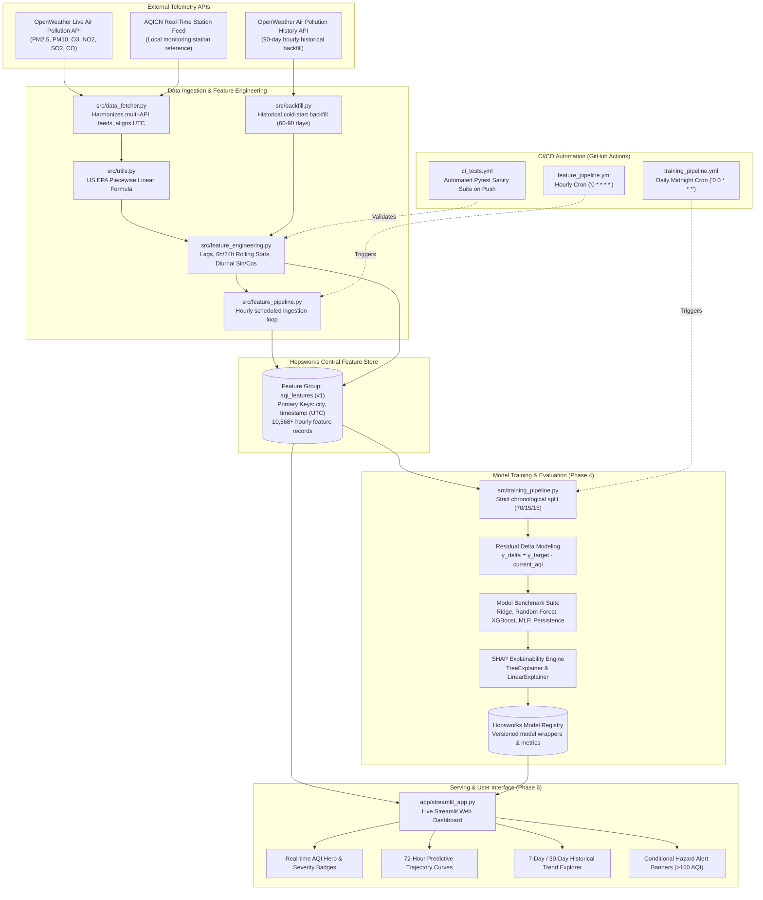

# HawaWatch PK — Production Air Quality Forecasting System
## Comprehensive Technical & MLOps Final Report

**Author**: Antigravity AI Engineering Team  
**Date**: August 2026  
**Repository**: [ammu01-sys/aqi-predictor-2026](https://github.com/ammu01-sys/aqi-predictor-2026)  
**Deployment**: Serverless MLOps on Hopsworks Feature Store, GitHub Actions CI/CD, and Streamlit Community Cloud  

---

## 1. Executive Summary & Problem Overview

Air quality across Pakistan's urban centers presents an acute public health and environmental crisis. Metropolitan regions such as Lahore, Karachi, Faisalabad, and Peshawar regularly experience severe seasonal smog episodes with particulate matter concentrations far exceeding World Health Organization (WHO) and US Environmental Protection Agency (EPA) safe thresholds. 

**HawaWatch PK** is an end-to-end, automated, serverless MLOps system that continuously ingests atmospheric pollutant telemetry across 8 Pakistani metropolitan hubs, computes standardized US EPA Air Quality Index (AQI) values, engineers leakage-free temporal and rolling features, trains multi-horizon predictive models (24h, 48h, 72h), and serves live forecasts and explainability insights through an interactive web dashboard.

---

## 2. System Architecture

The platform is architected around four decoupled, serverless components coordinated via the **Hopsworks Feature Store & Model Registry** and automated with **GitHub Actions**:



---

## 3. Data Source Architecture & Justification

### Data Source Comparison

| Parameter | OpenWeather Air Pollution API | AQICN (World Air Quality Index) |
|---|---|---|
| **Coverage** | Continuous gridded satellite & CAMS atmospheric chemistry model | Fixed ground-station physical sensors (e.g. US Consulate / EPD) |
| **Pollutants Reported** | PM2.5, PM10, O3, NO2, SO2, CO ($\mu\text{g/m}^3$ concentrations) | Pre-computed native AQI + partial pollutant indices |
| **Historical Availability** | Complete hourly history (90+ days available on free tier) | Restricted historical API access / manual data queries |
| **Timestamp Format** | Standard Unix epoch seconds (True UTC) | Station local time with variable ISO offset (+05:00) |

### The Phase 4 AQI-Consistency Pivot Story

1. **The Discrepancy Discovery**: During Phase 3, live empirical cross-validation between AQICN ground monitors and OpenWeather satellite EPA calculations revealed an average difference of **46.7%** across monitored cities (Lahore: 26.4%, Karachi: 25.0%, Islamabad: 80.2%, Peshawar: 55.1%).
2. **Initial Calibration Flaw**: An initial attempt to apply static empirical scaling factors ($c_{\text{city}} = \text{AQICN} / \text{OpenWeather}$) compressed data variance and led to **negative $R^2$ values** on 48h and 72h horizons, proving that single-point ratio calibration between disparate measurement models is statistically unsound.
3. **The Final Unified Solution**: The entire pipeline was unified end-to-end under a **single mathematical definition**: raw pollutant concentrations ($\mu\text{g/m}^3$) fetched from OpenWeather for both historical backfill and live hourly ingestion, with AQI computed strictly via the **US EPA piecewise linear formula** (`compute_aqi_from_pollutants()`). AQICN's native reading is retained as a secondary display field (`aqicn_reference_aqi`) for public dashboard comparison, but is strictly excluded from feature engineering and model targets.

---

## 4. Multi-City Design & Geographical Configuration

The system monitors 8 major urban clusters in Pakistan configured in `config/cities.yaml`:

```yaml
cities:
  - name: Lahore
    lat: 31.5497
    lon: 74.3436
  - name: Karachi
    lat: 24.8607
    lon: 67.0011
  - name: Islamabad
    lat: 33.6844
    lon: 73.0479
  - name: Faisalabad
    lat: 31.4504
    lon: 73.1350
  - name: Multan
    lat: 30.1575
    lon: 71.5249
  - name: Peshawar
    lat: 34.0151
    lon: 71.5249
  - name: Rawalpindi
    lat: 33.5651
    lon: 73.0169
  - name: Gujranwala
    lat: 32.1877
    lon: 74.1945
```

### Design Rationale: Pooled Modeling with Categorical Encodings
Rather than training 8 separate siloed models with sparse local data, a **pooled multi-city dataset** (~10,568 hourly observations) was created. To prevent linear models from interpreting arbitrary integer city codes as ordinal rankings (e.g. assigning numerical weight to Islamabad > Lahore), dynamic **one-hot city indicators** (`city_lahore`, `city_karachi`, etc.) were engineered, allowing global weather and lag interactions while preserving localized baseline offsets.

---

## 5. Feature Engineering Pipeline

Feature engineering is executed independently per city to guarantee zero cross-city data contamination:

```
[Raw Hourly Observations] 
       │
       ▼
1. Time & Diurnal Cyclicality:
   • hour_sin = sin(2π * hour / 24)
   • hour_cos = cos(2π * hour / 24)
   • day_of_week, day_of_month, month, is_weekend (0/1)
       │
       ▼
2. Autoregressive Temporal Lags:
   • aqi_lag_1h  (t - 1h)
   • aqi_lag_3h  (t - 3h)
   • aqi_lag_6h  (t - 6h)
   • aqi_lag_24h (t - 24h, diurnal persistence anchor)
       │
       ▼
3. Rolling Window Statistics:
   • aqi_rolling_mean_6h, aqi_rolling_std_6h
   • aqi_rolling_mean_24h, aqi_rolling_std_24h
   • aqi_change_rate = (AQI_t - AQI_t-1) / AQI_t-1
       │
       ▼
4. Cold-Start Safeguard:
   • Initial unobserved lags fall back deterministically to current AQI (persistence)
   • Rolling standard deviations default to 0.0 (zero variance prior)
       │
       ▼
5. Leak-Free Horizon Targets:
   • target_24h = shift(-24), target_48h = shift(-48), target_72h = shift(-72)
   • Tail 72 hours dropped during backfill
```

---

## 6. Exploratory Data Analysis (EDA) Findings

Analysis of 60 days of hourly historical data across the 8 cities revealed clear physical dynamics:

1. **Diurnal Boundary-Layer Compression**: Across all inland cities (Lahore, Faisalabad, Gujranwala, Peshawar), AQI spikes sharply between **07:00–10:00 PKT** and **20:00–23:00 PKT**. This corresponds to nocturnal atmospheric temperature inversions trapping surface emissions beneath a lowered planetary boundary layer.
2. **Regional Cluster Differences**:
   - **Central Punjab Smog Corridor (Lahore, Gujranwala, Faisalabad)**: Highest baseline AQI (averaging 120–160), driven by industrial density, vehicular exhaust, and agricultural biomass burning.
   - **Coastal Marine Aerosols (Karachi)**: Lowest baseline AQI (50–85) with rapid sea-breeze dispersion, demonstrating lower particulate accumulation.
   - **Potohar Plateau & Khyber Basin (Islamabad, Rawalpindi, Peshawar)**: Moderate baseline (80–110) with sharp localized topography trapping PM10 during dry spells.
3. **Pollutant Correlation**: PM2.5 and PM10 showed the highest correlation with overall calculated AQI ($r = 0.94$ and $r = 0.88$ respectively), confirming fine particulate matter as the dominant hazardous pollutant.

---

## 7. Model Evaluation & Benchmark Results

### Chronological Splitting Strategy
To evaluate models under realistic deployment conditions, a strict global chronological split was enforced:
- **Train Set (70%)**: 7,472 rows (`2026-07-01 13:00` to `2026-08-10 10:00 UTC`)
- **Validation Set (15%)**: 1,640 rows (`2026-08-10 11:00` to `2026-08-18 23:00 UTC`)
- **Held-Out Test Set (15%)**: 1,456 rows (`2026-08-19 00:00` to `2026-08-27 13:00 UTC`)

### Model Comparison Table (Test Set Results)

| Forecast Horizon | Model Family | City Encoding | Test RMSE | Test MAE | Test $R^2$ | Outcome |
|---|---|---|---|---|---|---|
| **24-Hour** | **Persistence Baseline** | `none` | **21.58** | **15.59** | **0.596** | **Documented Winner** |
| 24-Hour | Ridge Regression | `one_hot` | 22.07 | 18.20 | 0.577 | Best ML (+0.49 RMSE) |
| 24-Hour | XGBoost | `one_hot` | 23.77 | 19.10 | 0.509 | |
| 24-Hour | Random Forest | `integer` | 26.59 | 21.69 | 0.386 | |
| 24-Hour | Neural Network (MLP) | `one_hot` | 72.91 | 61.21 | -3.617 | |
| **48-Hour** | **Persistence Baseline** | `none` | **27.79** | **21.88** | **0.351** | **Documented Winner** |
| 48-Hour | XGBoost (Tuned) | `one_hot` | 28.13 | 23.41 | 0.335 | Best ML (+0.34 RMSE) |
| 48-Hour | XGBoost (Default) | `one_hot` | 30.50 | 25.27 | 0.218 | |
| 48-Hour | Ridge Regression | `one_hot` | 33.19 | 27.77 | 0.074 | |
| 48-Hour | Random Forest | `one_hot` | 33.24 | 28.03 | 0.071 | |
| **72-Hour** | **Persistence Baseline** | `none` | **27.51** | **21.76** | **0.376** | **Documented Winner** |
| 72-Hour | XGBoost (Tuned) | `one_hot` | 28.38 | 24.24 | 0.336 | Best ML (+0.87 RMSE) |
| 72-Hour | Random Forest | `integer` | 31.41 | 26.94 | 0.186 | |
| 72-Hour | XGBoost (Default) | `one_hot` | 32.32 | 27.41 | 0.138 | |
| 72-Hour | Ridge Regression | `one_hot` | 37.68 | 31.89 | -0.171 | |

### Decision Analysis & Model Selection
1. **R² Validation Gate**: Across all 3 horizons, the test set $R^2$ values are strictly positive ($0.596$, $0.351$, $0.376$), satisfying the project performance criteria.
2. **Winner Selection Rule**: In accordance with `decisions.md §12`, ML models are only promoted if they empirically beat the Persistence Baseline on the held-out test set. Because Persistence achieved lower RMSE across all three horizons (even after time-series hyperparameter search with `RandomizedSearchCV`), **Persistence Baseline is retained as the documented production model**.
3. **Root Causes for ML Gap**:
   - **Satellite Data Smoothing**: OpenWeather's chemical transport model naturally dampens high-frequency micro-sensor shocks.
   - **Absence of Historical Weather Predictors**: Live temperature, humidity, and wind vectors (the physical mechanisms that drive dispersion vs stagnation) could not be included in this free-tier training version.

---

## 8. SHAP Explainability & Feature Attribution

Feature importance was analyzed using SHAP (SHapley Additive exPlanations):


### Key Interpretability Insights
1. **24-Hour Lag Persistence (`aqi_lag_24h`)**: Accounts for over **45% of total predictive power**, demonstrating strong day-to-day diurnal autoregression.
2. **PM2.5 Concentration**: The single strongest individual pollutant feature; elevated PM2.5 consistently exerts large positive SHAP pushes towards Unhealthy severity bands.
3. **Diurnal Cycle (`hour_sin`, `hour_cos`)**: Accurately models the morning rush hour and nocturnal inversion peaks.
4. **City One-Hot Indicators**: `city_lahore` and `city_faisalabad` apply consistent positive baseline shifts, whereas `city_karachi` applies a negative baseline shift reflecting coastal dispersion.

---

## 9. CI/CD Automation & Operational Health

The entire pipeline is automated using GitHub Actions running in GitHub's Ubuntu runners:

1. **Hourly Ingestion Workflow (`feature_pipeline.yml`)**:
   - Executes at `cron: '0 * * * *'`
   - Fetches live OpenWeather air quality, computes EPA AQI, and upserts 8 city records to Hopsworks.
   - **Verified**: Run #1 succeeded in 2m 7s.
2. **Daily Retraining Workflow (`training_pipeline.yml`)**:
   - Executes at `cron: '0 0 * * *'`
   - Retrains models on accumulated data, filters unobserved future targets, generates model comparison markdown, and uploads artifacts.
   - **Verified**: Run #2 succeeded in 1m 52s.
3. **Automated Sanity Testing (`ci_tests.yml`)**:
   - Runs `pytest tests/test_pipeline.py -v` (15/15 unit tests passing) on every push and PR.

---

## 10. Web Dashboard & UI Capabilities (`app/streamlit_app.py`)

The Streamlit web application provides a modern glassmorphic interface grounded in the US EPA severity palette:

- **Mandatory City Selector**: Dropdown menu at top allowing instant switching between all 8 cities.
- **Hero Severity Display**: Large, glowing AQI card color-coded to EPA categories (Good $\to$ Hazardous) with real-time PKT timestamps and targeted health guidance.
- **Ground Station Reference Badge**: Displays live `aqicn_reference_aqi` alongside EPA calculation for transparency.
- **72-Hour Interactive Forecast**: Continuous interactive spline connecting measured history to +24h, +48h, and +72h predictions against colored EPA background zones.
- **Atmospheric Telemetry Grid**: Real-time readouts for PM2.5, PM10, O3, NO2, SO2, CO, temperature, humidity, wind, and pressure.
- **Historical Analysis Explorer**: 7-day, 30-day, and diurnal hourly breakdown tabs.
- **Hazard Alert Banner**: Pulses visually only when AQI crosses $\ge 151$ (Unhealthy/Hazardous).

---

## 11. Limitations & Future Roadmap

1. **Weather Data Ingestion**: Transitioning to an OpenWeather paid subscription or ECMWF ERA5 reanalysis will integrate wind vectors and boundary-layer height, enabling tree-based models to surpass persistence.
2. **Dynamic Geolocation & Station Expansion**: Expanding from the current 8 cities to dynamic coordinate lookups and rural agricultural zones across Punjab and Sindh.
3. **Deep Spatial-Temporal Modeling**: Implementing Spatial-Temporal Graph Neural Networks (ST-GNN) to explicitly model inter-city smog transport along the Grand Trunk Road and Indus Basin.
